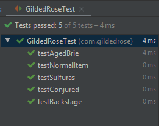
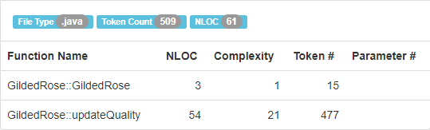
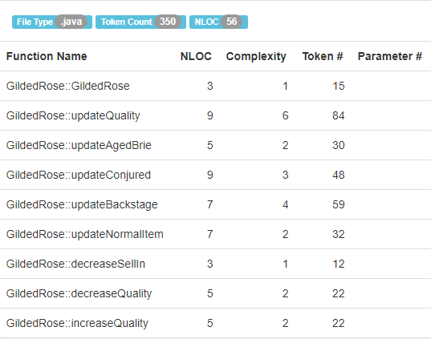
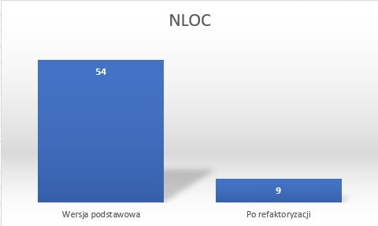
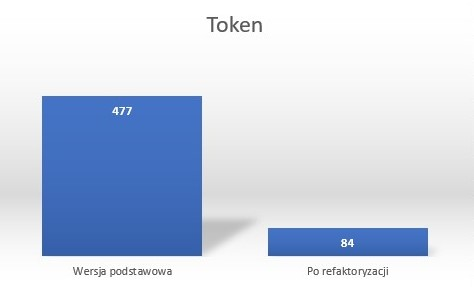

# Refaktoryzacja kodu GildedRose

**Sebastian Piaścik**

[Link do repozytorium](https://github.com/sebastianpiascik/zjp)

[Kod GildedRose](https://github.com/emilybache/GildedRose-Refactoring-Kata/tree/master/Java)

## 1. Testy

Przeprowadzono 5 testów jednostkowych, które miały na celu sprawdzenie poprawności napisanego kodu. Wszystkie przeszły pomyślnie.



## 2. Złożoność

**Złożoność cyklomatyczna kodu:**

- Przed refaktoryzacją: 



- Po refaktoryzacji




**Dane przedstawione na wykresach**







## 3. Kod

Kod źródłowy przed refaktoryzacją:

```
class GildedRose {
	public GildedRose(Item[] items) {
		this.items = items;
	}

	public void updateQuality() {
		for (int i = 0; i < items.length; i++) {
			if (!items[i].name.equals("Aged Brie") && !items[i].name.equals("Backstage passes to a TAFKAL80ETC concert")) {
				if (items[i].quality > 0) {
					if (!items[i].name.equals("Sulfuras, Hand of Ragnaros")) {
						items[i].quality = items[i].quality - 1;
						if(items[i].name.startsWith("Conjured")){
							items[i].quality = items[i].quality - 1;
						}
					}
				}
			} else {
				if (items[i].quality < 50) {
					items[i].quality = items[i].quality + 1;

					if (items[i].name.equals("Backstage passes to a TAFKAL80ETC concert")) {
						if (items[i].sellIn < 11) {
							if (items[i].quality < 50) {
								items[i].quality = items[i].quality + 1;
							}
						}

						if (items[i].sellIn < 6) {
							if (items[i].quality < 50) {
								items[i].quality = items[i].quality + 1;
							}
						}
					}
				}
			}

			if (!items[i].name.equals("Sulfuras, Hand of Ragnaros")) {
				items[i].sellIn = items[i].sellIn - 1;
			}

			if (items[i].sellIn < 0) {
				if (!items[i].name.equals("Aged Brie")) {
					if (!items[i].name.equals("Backstage passes to a TAFKAL80ETC concert")) {
						if (items[i].quality > 0) {
							if (!items[i].name.equals("Sulfuras, Hand of Ragnaros")) {
								items[i].quality = items[i].quality - 1;
								if(items[i].name.startsWith("Conjured")){
									items[i].quality = items[i].quality - 1;
								}
							}
						}
					} else {
						items[i].quality = items[i].quality - items[i].quality;
					}
				} else {
					if (items[i].quality < 50) {
						items[i].quality = items[i].quality + 1;
					}
				}
			}
		}
	}
}
```

Kod źródłowy po refaktoryzacji:

```
class GildedRose {
    Item[] items;
    
    public GildedRose(Item[] items) {
        this.items = items;
    }
    
    public void updateQuality() {
        for (Item item : items) {
            if (item.name.equals("Sulfuras, Hand of Ragnaros")) continue;
            else if (item.name.equals("Backstage passes to a TAFKAL80ETC concert"))  updateBackstage(item);
            else if (item.name.equals("Aged Brie")) updateAgedBrie(item);
            else if (item.name.startsWith("Conjured")) updateConjured(item);
            else updateNormalItem(item);
        }
    }
    
    public void updateAgedBrie(Item item) {
        decreaseSellIn(item);
        increaseQuality(item);
        if (item.sellIn < 0) increaseQuality(item);
    }
    
    public void updateConjured(Item item) {
        decreaseSellIn(item);
        for (int i = 0; i < 2; i++) {
            decreaseQuality(item);
            if (item.sellIn < 0) {
                decreaseQuality(item);
            }
        }
    }
    
    public void updateBackstage(Item item) {
        decreaseSellIn(item);
        increaseQuality(item);
        if (item.sellIn < 10) increaseQuality(item);
        if (item.sellIn < 5) increaseQuality(item);
        if (item.sellIn < 0) item.quality -= item.quality;
    }
    
    public void updateNormalItem(Item item) {
        decreaseSellIn(item);
        decreaseQuality(item);
        if (item.sellIn < 0) {
            decreaseQuality(item);
        }
    }
    
    public void decreaseSellIn(Item item) {
        item.sellIn--;
    }
    
    public void decreaseQuality(Item item) {
        if (item.quality > 0) {
            item.quality--;
        }
    }
    
    public void increaseQuality(Item item) {
        if (item.quality < 50) {
            item.quality++;
        }
    }
}
```

## 4. Refaktoryzacja

1. Zapoznanie się z kodem.
2. Zbadanie jakości kodu ( złożoność cyklomatyczna ).
3. Przeprowadzenie modyfikacji w kodzie:
	1. Zmiana pętli for na iterowanie po każdym elemencie:

    **Before:**
	
	```
	for (int i = 0; i < items.length; i++) { 
        items[i].( ... )    
    }
    ```

    **After:**
	
	```
	for (Item item : items) { 
        item.( ... )    
    }
    ```

	2. Usunięcie instrukcji if..else

    **Before:**
	
	```
    (...)
	if (!items[i].name.equals("Aged Brie") && !items[i].name.equals("Backstage passes to a TAFKAL80ETC concert")) {
        if (items[i].quality > 0) {
            if (!items[i].name.equals("Sulfuras, Hand of Ragnaros")) {
                items[i].quality = items[i].quality - 1;
                if(items[i].name.startsWith("Conjured")){
                    items[i].quality = items[i].quality - 1;
                }
            }
        }
    }    
    (...)
    ```

    **After:**
	
	```
    (...)
	if (item.name.equals("Sulfuras, Hand of Ragnaros"))  { (...) }
    else if (item.name.equals("Backstage passes to a TAFKAL80ETC concert"))  { (...) }
    else if (item.name.equals("Aged Brie"))  { (...) }
    else if (item.name.startsWith("Conjured"))  { (...) }
    else  { (...) }
    (...)
    ```
	
	3. Pozbycie się duplikacji oraz podzielenie kodu na metody (**Extract Method**)

    **Before:**
	
	```
	if (items[i].sellIn < 11) {
        if (items[i].quality < 50) {
            items[i].quality = items[i].quality + 1;
        }
    }
    if (items[i].sellIn < 6) {
        if (items[i].quality < 50) {
            items[i].quality = items[i].quality + 1;
        }
    }  
    ```

    **After:**
	
	```
    public void increaseQuality(Item item) {
        if (item.quality < 50) {
            item.quality++;
        }
    }
    if (item.sellIn < 11) increaseQuality(item);
    if (item.sellIn < 6) increaseQuality(item);
    ```

    **Before:**
	
	```
	if (items[i].quality > 0) {
        (...)
            items[i].quality = items[i].quality - 1;
        (...)
    }
    ```

    **After:**
	
	```
    public void decreaseQuality(Item item) {
        if (item.quality > 0) {
            item.quality--;
        }
    }
    decreaseQuality(item);
    ```


	4. Stworzenie odrębnej metody dla każdego typu elementu (**Extract Method**)

    **Before:**
	
	```
	if (item.name.equals("Sulfuras, Hand of Ragnaros")) continue;
    else if (item.name.equals("Backstage passes to a TAFKAL80ETC concert")) {
        decreaseSellIn(item);
        increaseQuality(item);
        if (item.sellIn < 10) increaseQuality(item);
        if (item.sellIn < 5) increaseQuality(item);
        if (item.sellIn < 0) item.quality -= item.quality;
    }
    else if (item.name.equals("Aged Brie")) {
        decreaseSellIn(item);
        increaseQuality(item);
        if (item.sellIn < 0) increaseQuality(item);
    }
    else if (item.name.startsWith("Conjured")) {
        decreaseSellIn(item);
        for (int i = 0; i < 2; i++) {
            decreaseQuality(item);
            if (item.sellIn < 0) {
                decreaseQuality(item);
            }
        }
    }
    else {
        decreaseSellIn(item);
        decreaseQuality(item);
        if (item.sellIn < 0) {
            decreaseQuality(item);
        }
    }
    ```

    **After:**
	
	```
	if (item.name.equals("Sulfuras, Hand of Ragnaros")) continue;
    else if (item.name.equals("Backstage passes to a TAFKAL80ETC concert"))  updateBackstage(item);
    else if (item.name.equals("Aged Brie")) updateAgedBrie(item);
    else if (item.name.startsWith("Conjured")) updateConjured(item);
    else updateNormalItem(item);

    public void updateAgedBrie(Item item) {
        decreaseSellIn(item);
        increaseQuality(item);
        if (item.sellIn < 0) increaseQuality(item);
    }
    public void updateConjured(Item item) {
        decreaseSellIn(item);
        for (int i = 0; i < 2; i++) {
            decreaseQuality(item);
            if (item.sellIn < 0) {
                decreaseQuality(item);
            }
        }
    }
    public void updateBackstage(Item item) {
        decreaseSellIn(item);
        increaseQuality(item);
        if (item.sellIn < 10) increaseQuality(item);
        if (item.sellIn < 5) increaseQuality(item);
        if (item.sellIn < 0) item.quality -= item.quality;
    }
    public void updateNormalItem(Item item) {
        decreaseSellIn(item);
        decreaseQuality(item);
        if (item.sellIn < 0) {
            decreaseQuality(item);
        }
    }
    ```

4. Ponowne sprawdzenie jakości kodu (krok 2) i przeprowadzenie testów
